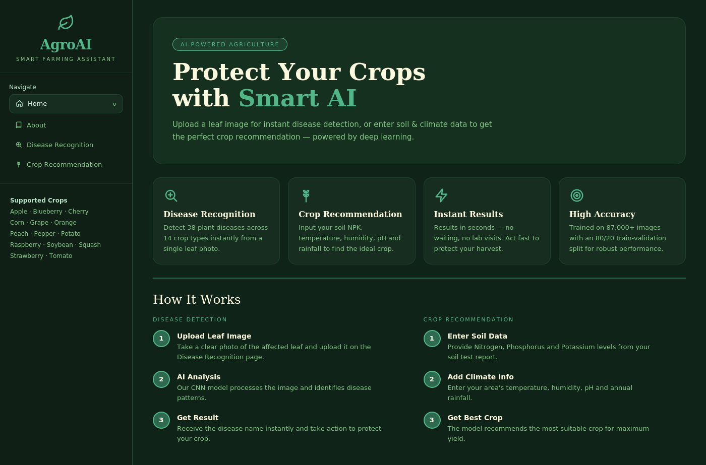
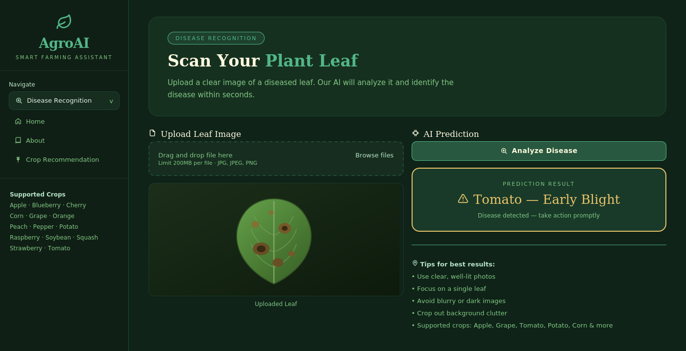
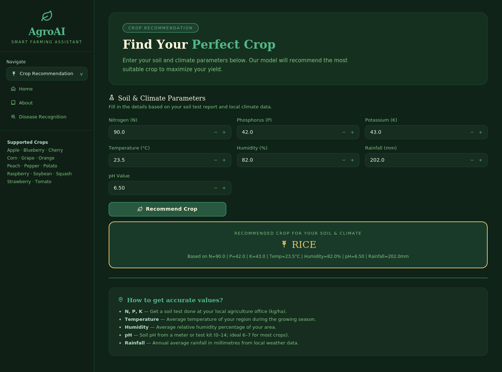
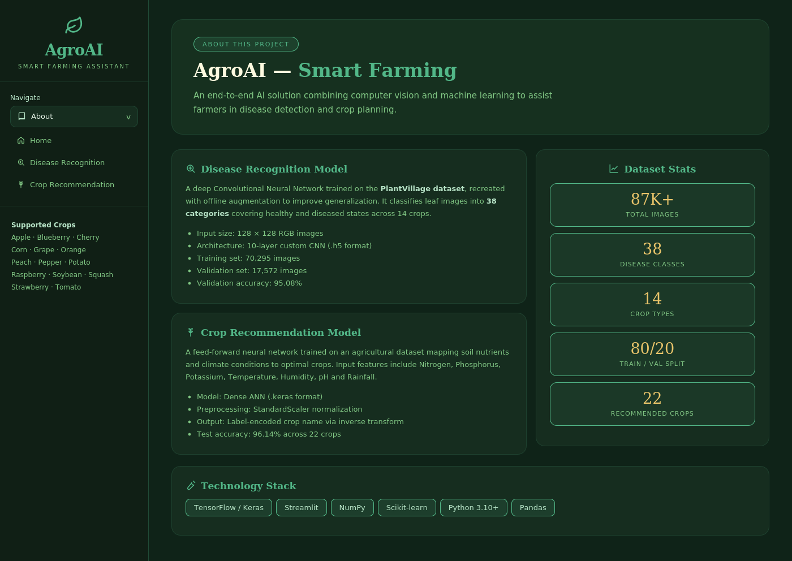
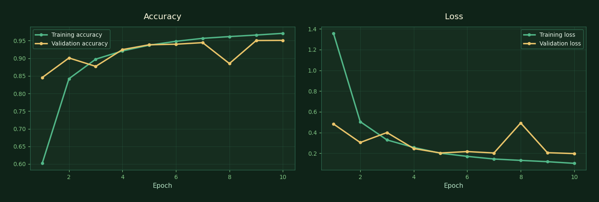

<div align="center">

# 🌿 AgroAI — Smart Farming Assistant

**AI-powered plant disease detection and crop recommendation, in one Streamlit app.**

Upload a leaf photo to identify one of 38 plant diseases across 14 crops, or enter your soil
and climate readings to get the crop best suited to your field.

[](https://agroai-smart-farming-166.streamlit.app/)
[](https://www.python.org/)
[](https://www.tensorflow.org/)
[](LICENSE)

### 👉 **[Try the live app](https://agroai-smart-farming-166.streamlit.app/)**



</div>

---

## 📑 Table of Contents

- [Overview](#-overview)
- [Features](#-features)
- [Screenshots](#-screenshots)
- [Tech Stack](#-tech-stack)
- [Model Architecture](#-model-architecture)
- [Results](#-results)
- [Datasets](#-datasets)
- [Project Structure](#-project-structure)
- [Getting Started](#-getting-started)
- [Usage Guide](#-usage-guide)
- [Deployment](#-deployment)
- [Roadmap](#-roadmap)
- [Author](#-author)

---

## 🌱 Overview

Crop disease is diagnosed late in most smallholder farms — usually after the damage has already
spread — because lab testing is slow, expensive, and far away. Crop selection has the same
problem: it is often decided by habit rather than by what the soil can actually support.

**AgroAI** puts both decisions in the farmer's hands in seconds. It bundles two trained deep
learning models behind a single, clean web interface:

|                            | What it does                                                    | Input                   | Output                       |
| -------------------------- | --------------------------------------------------------------- | ----------------------- | ---------------------------- |
| 🔬 **Disease Recognition** | Classifies a leaf photo into one of 38 healthy/diseased classes | A single leaf image     | Disease name + health status |
| 🌾 **Crop Recommendation** | Suggests the optimal crop for given field conditions            | 7 soil & climate values | Recommended crop (of 22)     |

No installation is required for end users — the app runs entirely in the browser via Streamlit
Cloud.

---

## ✨ Features

- **38-class disease classification** across 14 crop types — apple, blueberry, cherry, corn,
  grape, orange, peach, pepper, potato, raspberry, soybean, squash, strawberry and tomato.
- **22-crop recommendation engine** driven by Nitrogen, Phosphorus, Potassium, temperature,
  humidity, pH and rainfall.
- **Sub-second inference** — models are loaded locally, no external API calls, no rate limits.
- **Custom-designed dark UI** built with injected CSS on top of Streamlit — hero sections,
  feature cards, step guides and result panels rather than default widgets.
- **Health-aware result styling** — healthy predictions render green, diseases render amber with
  an action prompt.
- **Guided inputs** — every soil parameter ships with an explanation of how to measure it, so
  the tool stays usable for farmers without a lab report in hand.
- **Fully reproducible** — the training notebooks for both models are included in the repo.

---

## 📸 Screenshots

### Disease Recognition

Upload a leaf image and the CNN returns the diagnosis with a confidence-styled result panel.



### Crop Recommendation

Enter seven soil and climate readings; the ANN returns the best-matched crop along with the
exact inputs used, so results are traceable.



### About & Model Details

Dataset statistics, model specifications and the technology stack, surfaced in-app.



---

## 🛠 Tech Stack

| Layer                            | Technology                                             |
| -------------------------------- | ------------------------------------------------------ |
| **Deep Learning**                | TensorFlow 2.10, Keras                                 |
| **Classical ML / Preprocessing** | scikit-learn (StandardScaler, LabelEncoder)            |
| **Data & Numerics**              | NumPy, pandas                                          |
| **Visualization**                | Matplotlib, Seaborn                                    |
| **Frontend / Serving**           | Streamlit (custom CSS theme)                           |
| **Model Formats**                | `.h5` (CNN), `.keras` (ANN), `.pkl` (scaler & encoder) |
| **Deployment**                   | Streamlit Community Cloud                              |

---

## 🧠 Model Architecture

### 1. Disease Recognition — Convolutional Neural Network

A custom 10-layer CNN built from five convolutional blocks with progressively widening filters,
trained from scratch on 128×128 RGB leaf images.

```
Input (128 × 128 × 3)
│
├── Block 1 →  Conv2D(32, 3×3, same) → Conv2D(32, 3×3) → MaxPool(2×2)
├── Block 2 →  Conv2D(64, 3×3, same) → Conv2D(64, 3×3) → MaxPool(2×2)
├── Block 3 →  Conv2D(128, 3×3, same) → Conv2D(128, 3×3) → MaxPool(2×2)
├── Block 4 →  Conv2D(256, 3×3, same) → Conv2D(256, 3×3) → MaxPool(2×2)
├── Block 5 →  Conv2D(512, 3×3, same) → Conv2D(512, 3×3) → MaxPool(2×2)
│
├── Dropout(0.25)
├── Flatten
├── Dense(1500, ReLU)
├── Dropout(0.40)
└── Dense(38, Softmax)
```

| Hyperparameter | Value                     |
| -------------- | ------------------------- |
| Optimizer      | Adam                      |
| Learning rate  | `0.0001`                  |
| Loss           | Categorical cross-entropy |
| Batch size     | 32                        |
| Epochs         | 10                        |
| Regularization | Dropout (0.25 / 0.40)     |

### 2. Crop Recommendation — Artificial Neural Network

A compact fully-connected network on seven standardized tabular features.

```
Input (7 features: N, P, K, temperature, humidity, pH, rainfall)
│
├── Dense(128, ReLU) → Dropout(0.30)
├── Dense(64, ReLU)  → Dropout(0.30)
└── Dense(22, Softmax)
```

| Hyperparameter | Value                                                  |
| -------------- | ------------------------------------------------------ |
| Optimizer      | Adam                                                   |
| Loss           | Sparse categorical cross-entropy                       |
| Batch size     | 32                                                     |
| Max epochs     | 100                                                    |
| Early stopping | `patience=5` on `val_loss`, best weights restored      |
| Preprocessing  | `StandardScaler` on features, `LabelEncoder` on labels |
| Split          | 80 / 20 train-test, `random_state=42`                  |

---

## 📊 Results

| Model           | Metric              | Score       |
| --------------- | ------------------- | ----------- |
| **Disease CNN** | Training accuracy   | **97.07 %** |
| **Disease CNN** | Validation accuracy | **95.08 %** |
| **Disease CNN** | Validation loss     | **0.1969**  |
| **Crop ANN**    | Test accuracy       | **96.14 %** |
| **Crop ANN**    | Test loss           | **0.0908**  |

### Training Curves — Disease CNN



Validation accuracy tracks training accuracy closely across all ten epochs, with only a single
dip at epoch 8 before recovering — the dropout layers keep the 1500-unit dense head from
overfitting the 70K-image training set.

> Raw per-epoch history is stored in [`Models/training_hist.json`](Models/training_hist.json)
> if you want to re-plot or compare runs.

---

## 🗂 Datasets

### PlantVillage (Augmented) — Disease Recognition

| Split      | Images       |
| ---------- | ------------ |
| Training   | 70,295       |
| Validation | 17,572       |
| **Total**  | **≈ 87,900** |

Recreated from the original PlantVillage dataset using offline augmentation, preserving the
directory structure so labels are inferred directly from folder names. Covers 38 classes across
14 crops, including healthy controls for most species.

### Crop Recommendation Dataset

2,200 records mapping seven agronomic features to 22 crop labels, balanced at 100 samples per
crop. Features were standardized and labels integer-encoded before training.

> **Note:** Datasets are not committed to this repository due to size. Download them from Kaggle
> and place them alongside the notebooks before re-training.

---

## 📁 Project Structure

```
AgroAI-Smart-Farming/
│
├── App/
│   └── main.py                          # Streamlit application (UI + inference)
│
├── Models/
│   ├── trained_model.h5                 # Disease CNN  (~94 MB)
│   ├── crop_recommendation_model.keras  # Crop ANN
│   ├── scaler.pkl                       # StandardScaler fitted on training features
│   ├── label_encoder.pkl                # LabelEncoder for the 22 crop classes
│   └── training_hist.json               # Per-epoch CNN training history
│
├── NoteBooks/
│   ├── Train_plant_disease.ipynb        # CNN training pipeline
│   ├── Test_Plant_Disease.ipynb         # Evaluation, confusion matrix, single-image tests
│   └── Train_Crop_Recomendation.ipynb   # EDA + ANN training pipeline
│
├── assets/
│   └── screenshots/                     # Images used in this README
│
├── requirements.txt
└── README.md
```

---

## 🚀 Getting Started

### Prerequisites

- Python **3.10** or newer
- `pip` and `git`
- ~2 GB free disk space (the CNN weights file alone is ~94 MB)

### 1. Clone the repository

```bash
git clone https://github.com/usamazaheer166/AgroAI-Smart-Farming.git
cd AgroAI-Smart-Farming
```

### 2. Create a virtual environment

```bash
# Windows
python -m venv venv
venv\Scripts\activate

# macOS / Linux
python3 -m venv venv
source venv/bin/activate
```

### 3. Install dependencies

```bash
pip install -r requirements.txt
```

### 4. Run the app

```bash
streamlit run App/main.py
```

The app opens at **http://localhost:8501**.

> **Important:** run the command from the repository root. `main.py` resolves model paths
> relative to its parent directory, so launching from inside `App/` will break model loading.

---

## 📖 Usage Guide

### Disease Recognition

1. Open the **Disease Recognition** page from the sidebar.
2. Upload a leaf image (`JPG`, `JPEG` or `PNG`).
3. Click **Analyze Disease** and read the prediction.

**For the most reliable results:**

- Use bright, well-lit photographs
- Frame a single leaf, filling most of the shot
- Avoid blur, heavy shadow and cluttered backgrounds
- Stick to the 14 supported crops

### Crop Recommendation

1. Open the **Crop Recommendation** page.
2. Enter the seven field parameters below.
3. Click **Recommend Crop**.

| Parameter      | Unit  | How to obtain it                                    |
| -------------- | ----- | --------------------------------------------------- |
| Nitrogen (N)   | kg/ha | Soil test report from your local agriculture office |
| Phosphorus (P) | kg/ha | Soil test report                                    |
| Potassium (K)  | kg/ha | Soil test report                                    |
| Temperature    | °C    | Average temperature during the growing season       |
| Humidity       | %     | Average relative humidity for your area             |
| pH             | 0–14  | pH meter or test kit (6–7 suits most crops)         |
| Rainfall       | mm    | Annual average from local weather records           |

---

## ☁️ Deployment

The app is deployed on **Streamlit Community Cloud** at
[agroai-smart-farming-166.streamlit.app](https://agroai-smart-farming-166.streamlit.app/).

To deploy your own instance:

1. Fork this repository.
2. Sign in at [share.streamlit.io](https://share.streamlit.io) with your GitHub account.
3. Create a new app and point it at your fork.
4. Set the main file path to `App/main.py`.
5. Deploy — dependencies are installed automatically from `requirements.txt`.

> Because `trained_model.h5` is close to GitHub's 100 MB file limit, consider tracking it with
> [Git LFS](https://git-lfs.com/) if you plan to iterate on the weights.

---

## 🗺 Roadmap

- [ ] Display top-3 predictions with confidence scores instead of a single label
- [ ] Add treatment and pesticide recommendations for each detected disease
- [ ] Grad-CAM heatmaps to show which leaf regions drove the prediction
- [ ] Transfer learning baseline (EfficientNet / ResNet50) for comparison
- [ ] Urdu and regional-language interface for wider farmer adoption
- [ ] Mobile-first layout and camera capture support
- [ ] REST API endpoint so third-party apps can consume the models
- [ ] Yield prediction and fertilizer dosage modules

---

## 🤝 Contributing

Contributions are welcome. Fork the repository, create a feature branch, commit your changes and
open a pull request.

```bash
git checkout -b feature/your-feature
git commit -m "Add your feature"
git push origin feature/your-feature
```

---

## 📄 License

Released under the MIT License. See [`LICENSE`](LICENSE) for details.

---

## 👤 Author

**Usama Zaheer**
Computer Science student, National Textile University, Faisalabad

[](https://github.com/usamazaheer166)

---

## 🙏 Acknowledgements

- The **PlantVillage** project for the original leaf disease imagery
- The **Crop Recommendation** dataset authors on Kaggle
- **TensorFlow** and **Streamlit** for the model and serving toolchains

---

<div align="center">

**If this project helped you, consider starring the repository ⭐**

Built to help farmers make faster, better-informed decisions.

</div>
